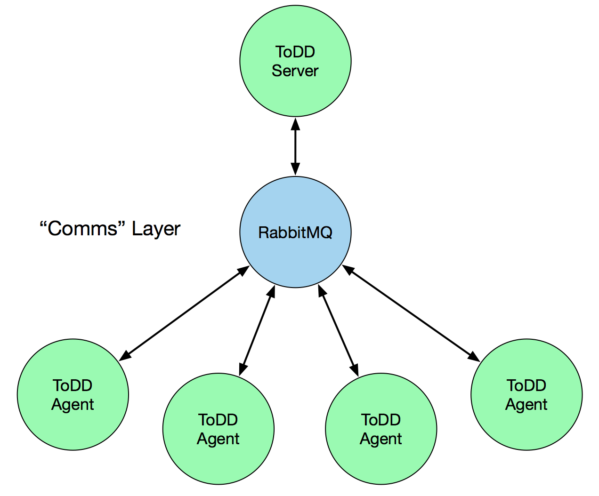

ToDD Agent Orchestration (Comms)
================================

In ToDD, we use a simple abstraction for communicating between the ToDD server and the agents, and this is implemented in the "comms" package. This abstraction allows ToDD to easily work with external messaging services like RabbitMQ, or Apache Kafka, etc - in order to facilitate distributed communications. As a result, ToDD agents do not actually speak directly with the ToDD server - they communicate indirectly through this third-party entitity.

As shown in `#18 <https://github.com/Mierdin/todd/issues/18>`_, this paradigm wasn't very well documented until now. ToDD still requires that some external entity like RabbitMQ is set up.

If you have no experience with doing this, please refer to 
`start-containers.sh <https://github.com/Mierdin/todd/blob/master/scripts/start-containers.sh#L44>`_ - this starts some docker containers running these services with reasonable defaults - suitable for getting started with ToDD.

Comms
-----

The "comms" abstraction within ToDD integrates with RabbitMQ (and others TBD) to provide this communication.

.. NOTE::
   The rest of this doc is primarily focused on developers looking to augment ToDD, either by adding a new comms plugin, or perhaps modifying an existing one.

Within this package, there is a file "comms.go" which contains little more than an interface and a base struct that all comms plugins must follow. In order to be considered a comms plugin, an implementation must satisfy the interface described there. This interface describes functions like AdvertiseAgent(), ListenForTasks(), and more. Through this, all plugins must implement the same behavior, and in theory, any comms plugin can be used to facilitate server-to-agent communications.

The rest of this documentation will describe the behind-the-scenes behavior of the comms plugins currently implemented within ToDD.

RabbitMQ
--------

The RabbitMQ plugin is the first comms plugin to be implemented within ToDD. This plugin uses a fairly simple model of communicating with agents, and while scale was and is an important goal for the ToDD project, the RabbitMQ plugin was designed primarily for ease of use.

