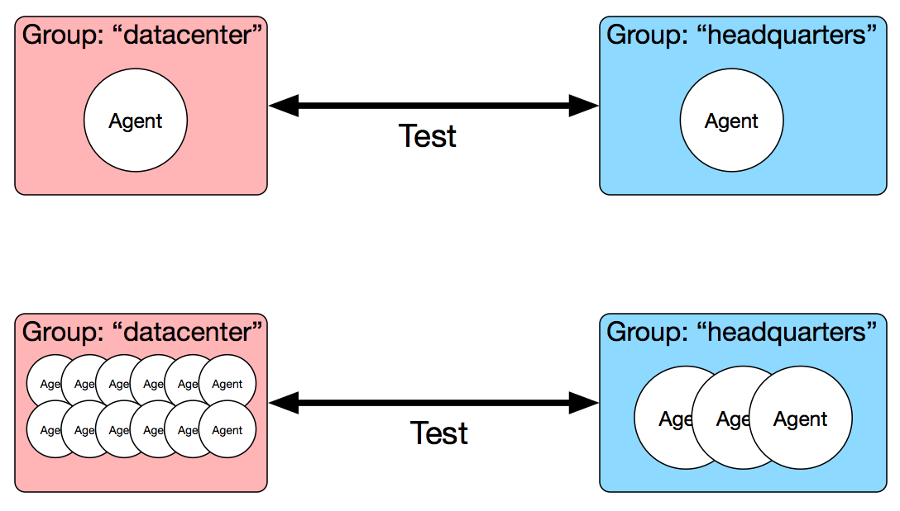

ToDD Concepts
================================

Before exploring the details of how ToDD actually works, it's important to first spend some
time understanding a few fundamental concepts.

Groups
------
In order to solve the problems that ToDD was created to solve, it was necessary to consider scale
from the beginning. In ToDD, testing is performed much more like "cattle" than "pets". As a result,
tests are not performed with discrete endpoints, such as ToDD agents, but rather with "groups".

.. NOTE::

   At it's lowest level, testing in ToDD is done either from a group of agents, or between groups of
   agents. It does not deal with individual agents. This is a very important concept to remember,
   as all other concepts build on this.

You should still consider a "group" as a singular logical endpoint for a test, even though there
may be multiple actual endpoints within that group.

Groups can contain as few as a single ToDD agent, or as many as tens or even hundreds. The idea
is to detach the concept of testing from discrete nodes or IP addresses, and provide a grouping
mechanism that allows the ToDD user to adjust the scale or power of a test without fundamentally
changing its parameters.

This concept shows its true power when you compare two instances of the same test being run. In the
diagram below, we have two instances of the same test. In the first instance, only one agent is
present in each group. In the second, several additional agents are present in each group:

Note that both the group configuration, as well as the configuration of the test itself, are identical
between these two test instances. This is because the mechanism by which you describe groups in ToDD
allows you to anticipate different "test topologies" ahead of time. Tests are performed between groups,
regardless of what the group happened to contain at test time.

For instance, the group "datacenter" might be configured to include all agents that belong to a
certain subnet. Once this configuration is in place, scaling this group to include additional
agents is a simple matter of spinning up additional agents that belong to that subnet.

.. NOTE::

   See the "Group" section of the `Objects Documentation <using/objects.html>`_  for more info on
   what parameters can be used to assign agents to groups.

So, at this point, you can probably think of groups best as a scaling mechanism. ToDD assumes you have
other tools, such as Kubernetes, for automating this, and tries only to allow you to describe how that
might look so that ToDD can automatically use resources you've provided for it.

Testruns
--------

**The "testrun" is the most atomic unit of testing in ToDD**. It is the abstraction upon which all other forms
of test automation is built.

In the previous section, we discussed how testing is done using ToDD Groups, and not with discrete agents.
The testrun is where this idea manifests itself, as testruns are a logical point-to-point concept. They're
always taking place either between a group of ToDD agents and a group of "dumb" endpoints, or between
two ToDD groups. While it's true that there may be (and probably should be) many actual, addressable endpoints
taking place in a test, the testrun is still describing a point-to-point relationship.

The testrun configuration is designed to answer three questions:

* What are the two ends of the test?
* What application am I testing with?
* What kind of parameters does this test need to be successful?

.. NOTE::

   See the "Testrun" section of the `Objects Documentation <using/objects.html>`_  for more information on the
   specific syntax used to describe a testrun.

Again, the Testrun is the most atomic unit of testing in ToDD. As a result, there are a few things that a testrun
does **not** do:

* **Testing beyond more than two endpoints** - testruns are group to group only
* **Aggregate metrics** - all metrics are reported individually, per-agent.
* **Automatically run themselves** - testruns are either started manually via the CLI, or programmatically.

Testruns intentionally do not do these things because they're leaving room for future, higher-level abstractions to do them.

.. NOTE::

    The concepts that will be involved with doing these things are still a work-in-progress, and feedback on how these
    things should be done is welcome. In the meantime, ToDD tries to be as open as possible, so that you can solve
    these things for yourself until they're done in ToDD.
