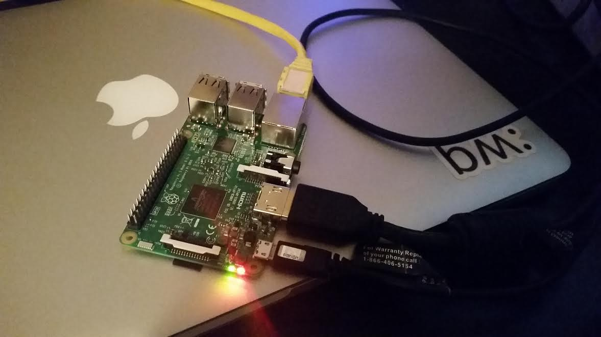

Installing on Raspberry Pi
================================

.. IMPORTANT::
   These instructions were tested on several Raspberry Pi 3 (Model B). In theory, these instructions should work for other models, but may require some minor modifications.

Housekeeping
------------

In case you're new to Raspberry Pis, you can use these instructions to get a basic configuration going. This section assumes you bought the SD card with NOOBS preloaded onto it (which is recommended if you're new - it greatly simplifies the OS install)

When you first boot your Raspberry Pi, you'll be presented with the NOOBS setup. Follow the install guide, selecting "raspbian" as your operating system.

After the install finishes and you reboot your RPi, open the Raspberry Pi configuration from the button in the top left part of the screen. It's a good idea to edit a few of these. Here are some good ideas:

- Boot to CLI, not desktop
- Set hostname to something useful
- Uncheck auto login
- Change the default password for the "pi" account

Finally, open the terminal and run ``ip addr show eth0`` to grab the MAC address of your Pi. It is recommended that you configure the RPi to use DHCP to derive a network address, and you can use this MAC address to reserve an IP address for the Pi on your DHCP server.

Now, reboot one more, and you can finish the rest of this guide purely over SSH. You should only need a network connection and power for the rest of these steps.

Install Go
----------

This install guide will use Go 1.6, but other than that, channels the excellent `Go 1.5 on RPi install instructions <http://dave.cheney.net/2015/09/04/building-go-1-5-on-the-raspberry-pi>`_  by Dave Cheney.

An abbreviated version of those instructions, modified for Go 1.6, is shown below:

.. code-block:: text

    cd $HOME
    mkdir workspace
    curl https://storage.googleapis.com/golang/go1.6.src.tar.gz | tar xz
    curl http://dave.cheney.net/paste/go-linux-arm-bootstrap-c788a8e.tbz | tar xj
    cd $HOME/go/src
    GO_TEST_TIMEOUT_SCALE=10 GOROOT_BOOTSTRAP=$HOME/go-linux-arm-bootstrap ./all.bash
    export GOPATH="$HOME/workspace/"
    export PATH="$PATH:$HOME/go/bin/"

I also added these to my .bashrc:

.. code-block:: text

    alias ll='ls -lha'
    PATH=$PATH:$HOME/go/bin
    GOPATH=$HOME/workspace

Install ToDD
------------

From now on, you can follow the canonical `install instructions <install.html>`_ to install ToDD. As a reminder, you first retrieve the ToDD source using ``go get``, then navigate to that directory:

.. code-block:: text

    go get -d github.com/Mierdin/todd
    cd $GOPATH/src/github.com/Mierdin/todd

Next, use make to compile ToDD. Be patient, the first step can take a while on the Raspberry Pi. (On the RPi3 this can be up to 15 mins!)

.. code-block:: text

    make
    sudo make install

.. NOTE::

    On some versions of Go, you may need to set the environment variable "GOARM" to "5".

Run ToDD Agent
--------------

It's likely that you'll want to run the ToDD agent as a service. Use this systemd unit file as a starting example, and don't forget to enable the service so that it starts automatically at boot!

.. code-block:: text

    pi@todd-pi-01:~ $ cat /etc/systemd/system/todd-agent.service
    [Unit]
    Description=ToDD Agent

    [Service]
    ExecStart=/usr/bin/todd-agent

    [Install]
    WantedBy=network.target

Next, enable and start the service, and check the status to ensure it's running without issues. You should see something like this:

.. code-block:: text

    pi@todd-pi-01:~ $ sudo systemctl enable todd-agent
    pi@todd-pi-01:~ $ sudo systemctl start todd-agent.service
    pi@todd-pi-01:~ $ sudo systemctl status todd-agent
     todd-agent.service - ToDD Agent
       Loaded: loaded (/etc/systemd/system/todd-agent.service; static)
       Active: active (running) since Thu 2016-04-21 08:13:58 UTC; 33min ago
     Main PID: 8532 (todd-agent)
       CGroup: /system.slice/todd-agent.service
               └─8532 /usr/bin/todd-agent

    Apr 21 08:47:16 todd-pi-02 todd-agent[8532]: time="2016-04-21T08:47:16Z" level=info msg="AGENTADV -- 2016-04-21 08:47:16.577100389 +0000 UTC"
    Apr 21 08:47:16 todd-pi-02 todd-agent[8532]: time="2016-04-21T08:47:16Z" level=debug msg="Retrieving value of key - unackedGroup"
    Apr 21 08:47:18 todd-pi-02 todd-agent[8532]: time="2016-04-21T08:47:18Z" level=debug msg="Retrieving value of key - unackedGroup"
    Apr 21 08:47:20 todd-pi-02 todd-agent[8532]: time="2016-04-21T08:47:20Z" level=debug msg="Retrieving value of key - unackedGroup"
    Apr 21 08:47:21 todd-pi-02 todd-agent[8532]: time="2016-04-21T08:47:21Z" level=debug msg="Agent task received: {\"type\":\"SetGroup\",\"groupName\":\"rpi\"}"
    Apr 21 08:47:21 todd-pi-02 todd-agent[8532]: time="2016-04-21T08:47:21Z" level=debug msg="Retrieving value of key - group"
    Apr 21 08:47:21 todd-pi-02 todd-agent[8532]: time="2016-04-21T08:47:21Z" level=info msg="Already in the group being dictated by the server: rpi"
    Apr 21 08:47:22 todd-pi-02 todd-agent[8532]: time="2016-04-21T08:47:22Z" level=debug msg="Retrieving value of key - unackedGroup"
    Apr 21 08:47:24 todd-pi-02 todd-agent[8532]: time="2016-04-21T08:47:24Z" level=debug msg="Retrieving value of key - unackedGroup"
    Apr 21 08:47:26 todd-pi-02 todd-agent[8532]: time="2016-04-21T08:47:26Z" level=debug msg="Retrieving value of key - unackedGroup"
